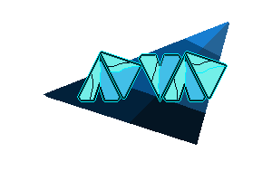

# ADVAD

Advad is a fast-paced 2D space shooter game prototype developed with the Godot 4.5 engine. Pilot your ship through dangerous asteroid fields and confront enemies as you dodge, shoot, and survive to achieve the highest score.

## Key Features

- **Dynamic Movement:** Control your ship with an acceleration and friction-based movement system.
- **Shooting and Combat:** Engage in combat against waves of enemies and obstacles.
- **Dash Mechanic:** Evade dangers with a quick boost that makes you invulnerable for a short period.
- **Ship Selection:** Choose from 20 different ship designs to customize your experience.
- **Visual Effects:** Enjoy particle effects, explosions, and a CRT shader that gives it a retro touch.
- **Scoring System:** Compete for the highest score.
- **Discord Support:** Integration with Discord RPC to display your game status.

## How to Play

### Controls

- **Movement:** `W`, `A`, `S`, `D` or `Arrow Keys`
- **Shoot:** `Spacebar`
- **Dash (Boost):** `E`
- **Pause:** `Escape`
- **Skip Cutscenes:** `Enter`

## Game Flow and Pipeline

The game flow is designed as a fast-paced arcade loop focused on progression through phases of increasing difficulty.

1.  **Start and Main Menu (`main_menu.tscn`):**
	*   The game begins in the main menu.
	*   The player can start a game, go to the ship selection screen (`skin_selector.tscn`), view credits, or exit.
	*   The selected ship is stored globally in the `GameManager` singleton.

2.  **Starting the Game:**
	*   Upon pressing "Play", the game state is reset via `GameManager.reset_game_state()`, setting the score to 0 and the initial phase to 1.
	*   The main game scene (`main.tscn`) is loaded.

3.  **Gameplay Loop (`main.tscn` and `PhaseManager`):**
	*   Progression is controlled by the `PhaseManager` node.
	*   At the start, `PhaseManager` initiates the phase stored in `GameManager.phase_to_start`.
	*   Each phase has two conditions: a **score objective** and a **time limit**.
	*   Difficulty (enemy speed and quantity) adjusts dynamically at the beginning of each phase.

4.  **Progression and Retries:**
	*   **Phase Success:** If the player reaches the required score within the time limit, the phase is successfully completed. `PhaseManager` increments the phase counter in `GameManager` and immediately starts the next phase, increasing difficulty without reloading the scene.
	*   **Failure (Time or Death):**
		*   If time runs out or the player dies, the game scene is reloaded (`get_tree().reload_current_scene()`).
		*   Since the phase was not completed, the `phase_to_start` value in `GameManager` is not incremented.
		*   This causes the player to **retry the same phase** from the beginning, creating a fast and challenging game loop.

5.  **Victory:**
	*   After successfully completing the last phase, `PhaseManager` stops enemy generation and removes a barrier in the level, indicating that the player has won the arena.

## Project Structure

The project is organized into the following main folders:

-   **`/Scenes`**: Contains all game scenes, such as the main menu, levels, and individual components (player, enemies, asteroids).
-   **`/Scripts`**: Houses all GDScript scripts that control the game's logic.
-   **`/Assets`**: Includes all artistic and audio resources, such as sprites, fonts, and sound effects.
-   **`/Autoloads`**: Contains singleton node scripts that manage the global game state, such as `GameManager.gd`.
-   **`/addons`**: Stores third-party plugins used in the project, such as Discord integration and a Kanban task system.
-   **`project.godot`**: The main Godot project configuration file.

### Key Scripts

-   **`GameManager.gd`**: Manages the global game state, including score, ship selection, and pause status. It is crucial for maintaining progression between scenes.
-   **`PhaseManager.gd`**: Controls the main game loop, managing phases, difficulty, score objectives, and time limits.
-   **`main.gd`**: Controls the logic of the main game scene, player death, and visual effects.
-   **`player.gd`**: Defines the player's behavior, including movement, shooting, and the dash mechanic.

## Credits

-   **Development and Design:** ANGELUS11 and Cro128
-   **Music by:** [Psychronic Games](https://pixabay.com/es/users/psychronic-13092015/)
-   **Engine:** [Godot Engine](https://godotengine.org/)

## License

This project is distributed under the MIT License. See the `LICENSE` file for more details.
